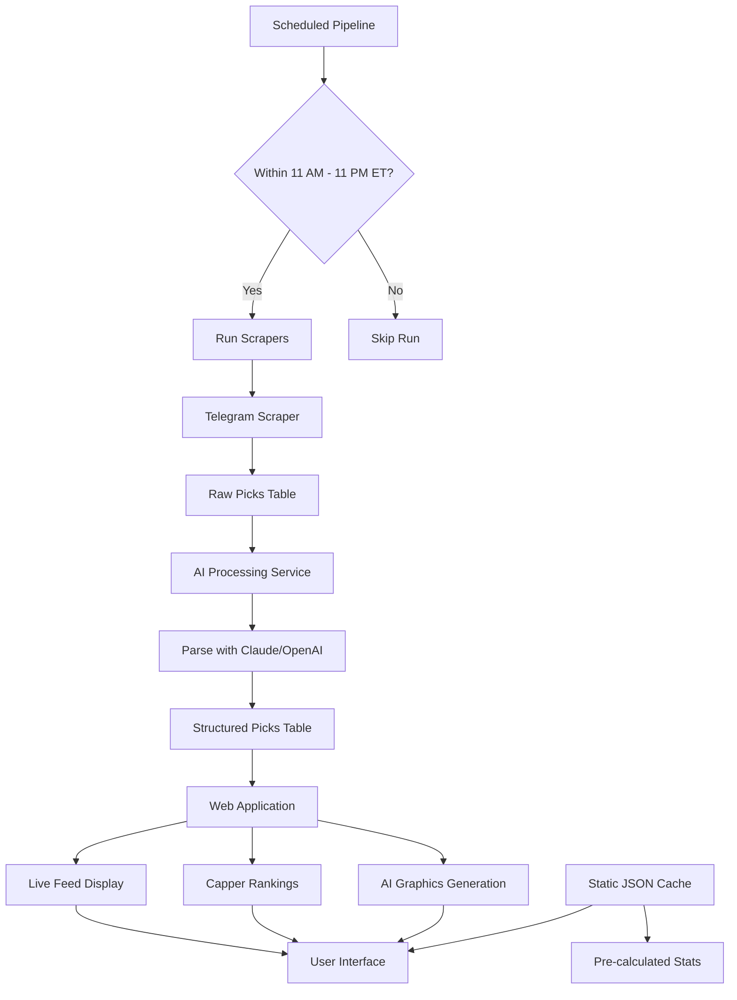
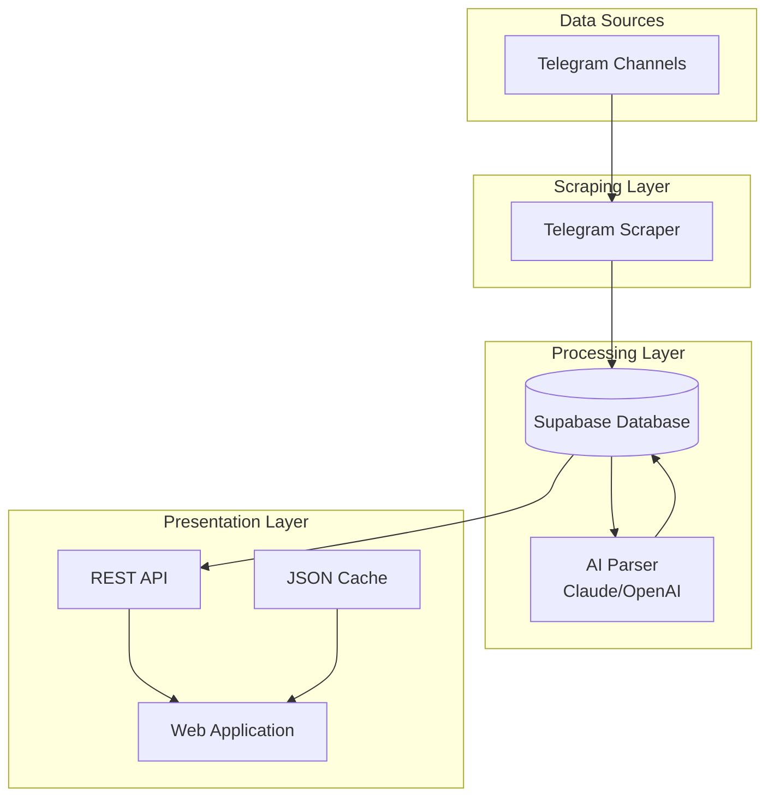

# CappersTracked Live Feed

This is a modern web application for scraping, analyzing, and displaying sports picks from various sources. It features an AI-powered parsing pipeline, a ranked live feed, and on-demand AI graphic generation.

## Table of Contents

- [Overview](#overview)
- [Architecture](#architecture)
- [Features](#features)
- [Technology Stack](#technology-stack)
- [Project Structure](#project-structure)
- [Data Flow](#data-flow)
- [Setup Instructions](#setup-instructions)
- [Usage](#usage)
- [API Reference](#api-reference)
- [Contributing](#contributing)
- [License](#license)

## Overview

CappersTracked is a comprehensive sports betting analytics platform that automates the collection, processing, and presentation of sports picks from multiple sources. The system uses AI to parse unstructured text into structured data, maintains a live feed of picks ranked by capper performance, and provides on-demand graphic generation for sharing performance metrics.

## Architecture

The application follows a modular architecture with separate components for scraping, processing, and presentation:

### System Flow Chart



### Component Diagram



## Features

### Core Features

- **Multi-Source Scraping**: Pulls raw picks from Telegram channels
- **AI-Powered Parsing**: Uses Claude or OpenAI models to robustly parse unstructured text into structured pick data
- **Scheduled Data Pipeline**: Automated scripts run during operational hours (11 AM - 11 PM ET)
- **Ranked Live Feed**: Real-time display of latest picks sorted by capper performance
- **On-Demand AI Graphics**: Instant generation of formatted text summaries for shareable graphics
- **Static JSON Cache**: Pre-calculated capper statistics for fast loading

### Advanced Features

- **OCR Support**: Optional image processing for picks shared as images
- **Duplicate Prevention**: Hash-based deduplication to prevent duplicate entries
- **Capper Directory**: Centralized management of capper identities
- **Unit Size Tracking**: Support for fractional bet units (0.5, 1.5, etc.)
- **Multi-League Support**: NFL, NBA, MLB, NHL, NCAAF, NCAAB, and more

## Technology Stack

### Backend
- **Python 3.8+**: Core application logic
- **Supabase**: PostgreSQL database with real-time capabilities
- **OpenRouter/Claude/OpenAI**: AI parsing and graphics generation
- **Telethon**: Telegram API client for scraping
- **AsyncIO**: Asynchronous processing for performance

### Frontend
- **HTML5/CSS3/JavaScript**: Modern web interface
- **Responsive Design**: Mobile-friendly layout

### Infrastructure
- **Docker** (optional): Containerized deployment
- **GitHub Actions**: CI/CD and scheduled runs
- **Environment Variables**: Secure configuration management

### Libraries
- **python-dotenv**: Environment variable management
- **supabase-py**: Database client
- **openai**: AI service integration
- **telethon**: Telegram scraping
- **requests**: HTTP client
- **opencv-python**: Image processing
- **pytesseract**: OCR functionality
- **pandas**: Data manipulation
- **pytz**: Timezone handling

## Project Structure

```
cappers-tracked/
├── README.md                    # Project documentation
├── requirements.txt             # Python dependencies
├── .env                         # Environment variables (not committed)
├── .env.example                 # Environment template
├── .gitignore                   # Git ignore rules
│
├── scrapers.py                  # Multi-source scraping logic
├── processing_service.py        # AI parsing and data processing
├── run_pipeline.py              # Main orchestration script
├── maintenance.py               # Database maintenance utilities
├── test.py                      # Unit tests
│
├── find_channel_id.py           # Telegram channel discovery
├── generate_session_string.py   # Telegram session setup
├── copy_code.py                 # Utility script
│
├── index.html                   # Web application frontend
├── app.py                       # Web application backend (if exists)
│
└── static/                      # Static assets (if applicable)
    └── cache/
        └── capper_stats.json    # Pre-calculated statistics
```

## Data Flow

1. **Scraping Phase**:
    - Telegram scraper connects to configured channels
    - Raw picks stored in `raw_picks` table with status 'pending'

2. **Processing Phase**:
    - AI service parses unstructured text into structured data
    - Capper names normalized and stored in `capper_directory`
    - Structured picks inserted into `live_picks` table

3. **Presentation Phase**:
    - Web application queries live picks with capper rankings
    - Static JSON cache provides fast access to statistics
    - AI graphics generated on-demand for performance summaries

## Setup Instructions

### Prerequisites

- Python 3.8 or higher
- Supabase account and project
- OpenRouter or OpenAI API key
- Telegram API credentials (for scraping)
- Tesseract OCR (optional, for image processing)

### 1. Environment Configuration

Create a `.env` file in the project root using `.env.example` as a template:

```env
# Supabase Credentials (Required)
SUPABASE_URL="your_supabase_url"
SUPABASE_SERVICE_ROLE_KEY="your_supabase_service_key"

# Telegram Scraping (Optional)
TELEGRAM_API_ID="your_telegram_api_id"
TELEGRAM_API_HASH="your_telegram_api_hash"
TELEGRAM_SESSION_NAME="your_session_string"
TELEGRAM_CHANNEL_URLS="channel_id_1,channel_id_2"

# AI Service (Required for parsing)
OPENROUTER_API_KEY="your_openrouter_api_key"
AI_PARSER_MODEL="anthropic/claude-3-haiku"

# OCR (Optional)
TESSERACT_PATH="/usr/bin/tesseract"  # Adjust for your system
```

### 2. Install Dependencies

```bash
pip install -r requirements.txt
```

### 3. Database Setup

Create the following tables in your Supabase project:

#### raw_picks table
```sql
CREATE TABLE raw_picks (
    id SERIAL PRIMARY KEY,
    capper_name TEXT,
    raw_text TEXT NOT NULL,
    pick_date DATE NOT NULL,
    source_url TEXT,
    source_unique_id TEXT UNIQUE NOT NULL,
    status TEXT DEFAULT 'pending',
    created_at TIMESTAMP WITH TIME ZONE DEFAULT NOW()
);
```

#### capper_directory table
```sql
CREATE TABLE capper_directory (
    id SERIAL PRIMARY KEY,
    canonical_name TEXT UNIQUE NOT NULL,
    created_at TIMESTAMP WITH TIME ZONE DEFAULT NOW()
);
```

#### live_picks table
```sql
CREATE TABLE live_picks (
    id SERIAL PRIMARY KEY,
    capper_id INTEGER REFERENCES capper_directory(id),
    pick_date DATE NOT NULL,
    league TEXT,
    pick_value TEXT,
    bet_type TEXT,
    unit DECIMAL(4,2) DEFAULT 1.0,
    odds_american INTEGER,
    created_at TIMESTAMP WITH TIME ZONE DEFAULT NOW()
);
```

### 4. Telegram Setup (Optional)

If using Telegram scraping:

1. Create a Telegram application at https://my.telegram.org/
2. Generate an API ID and hash
3. Run `generate_session_string.py` to create a session string
4. Add channel IDs using `find_channel_id.py`

### 5. Run the Application

#### Option A: Run Pipeline Manually
```bash
python run_pipeline.py
```

#### Option B: Schedule with Cron
```bash
# Run every 30 minutes during operational hours
*/30 11-22 * * * cd /path/to/project && python run_pipeline.py
```

#### Option C: GitHub Actions
Set up a workflow file for automated scheduling.

## Usage

### Running the Pipeline

The main pipeline can be executed in several ways:

1. **Manual Execution**:
    ```bash
    python run_pipeline.py
    ```

2. **Test Individual Components**:
    ```bash
    # Test scrapers only
    python scrapers.py

    # Test processing only
    python processing_service.py
    ```

3. **Maintenance Operations**:
    ```bash
    python maintenance.py
    ```

### Web Interface

Open `index.html` in a web browser to access the live feed interface.

### API Endpoints

The application provides REST API endpoints for data access:

- `GET /api/picks` - Retrieve live picks with rankings
- `GET /api/cappers` - Get capper directory
- `GET /api/stats/{capper_id}` - Get capper statistics
- `POST /api/graphics` - Generate AI graphics

## API Reference

### Get Live Picks
```http
GET /api/picks?limit=50&sort=rank
```

Response:
```json
[
  {
    "id": 1,
    "capper_name": "Sports Analyst Pro",
    "league": "NFL",
    "pick_value": "Kansas City Chiefs -3.5",
    "bet_type": "Spread",
    "unit": 1.0,
    "odds_american": -110,
    "rank": 1,
    "win_rate": 0.65
  }
]
```

### Generate Graphics
```http
POST /api/graphics
Content-Type: application/json

{
  "capper_id": 123,
  "timeframe": "30d"
}
```

## Contributing

1. Fork the repository
2. Create a feature branch (`git checkout -b feature/amazing-feature`)
3. Commit your changes (`git commit -m 'Add amazing feature'`)
4. Push to the branch (`git push origin feature/amazing-feature`)
5. Open a Pull Request

### Development Guidelines

- Follow PEP 8 style guidelines
- Add type hints for new functions
- Include docstrings for public methods
- Write unit tests for new features
- Update documentation for API changes

## Troubleshooting

### Common Issues

1. **Telegram Connection Failed**
    - Verify API credentials
    - Regenerate session string
    - Check channel permissions

2. **AI Parsing Errors**
    - Verify OpenRouter API key
    - Check model availability
    - Review prompt formatting

3. **Database Connection Issues**
    - Confirm Supabase credentials
    - Check network connectivity
    - Verify table schemas

### Logs

All components write detailed logs to stdout/stderr. Check logs for error details:

```bash
python run_pipeline.py 2>&1 | tee pipeline.log
```

## License

This project is licensed under the MIT License - see the LICENSE file for details.