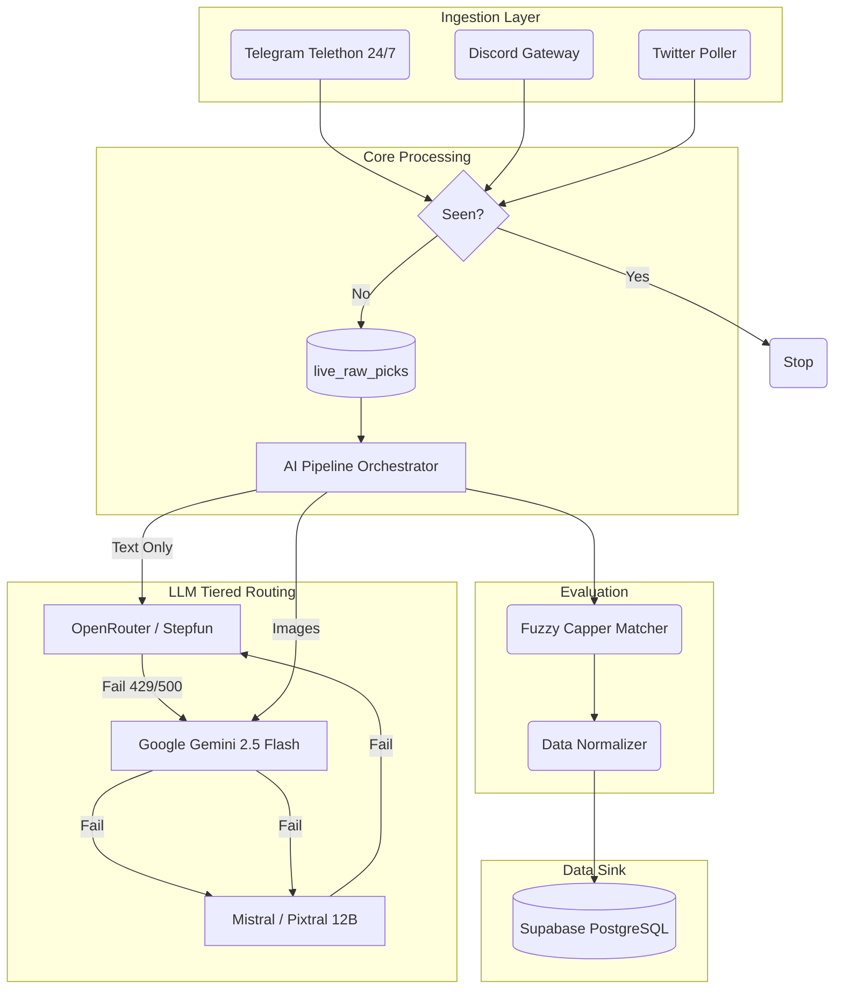

# 🏆 CapperSuite Live Pick Scraper

A robust, ultra-efficient, 24/7 event-driven daemon designed to monitor multi-channel sports handicapper environments (Telegram, Discord, Twitter), classify messages, and seamlessly extract structured betting picks directly into highly-available edge databases.

Built with Python 3.11+, asynchronous WebSockets, and a redundant, tiered AI extraction pipeline to maximize uptime and minimize LLM costs.

---

## ⚡ Architecture Overview


```mermaid
flowchart TD
    subgraph Ingestion Layer
        TG(Telegram Telethon 24/7)
        DC(Discord Gateway)
        TW(Twitter Poller)
    end
    
    subgraph Core Processing
        Dedupe{Seen?}
        StoreRaw[(live_raw_picks)]
        AI[AI Pipeline Orchestrator]
    end
    
    subgraph Evaluation
        Matcher(Fuzzy Capper Matcher)
        Format(Data Normalizer)
    end

    subgraph LLM Tiered Routing
        Gem[Google Gemini 2.5 Flash]
        Mist[Mistral / Pixtral 12B]
        OR[OpenRouter / Stepfun]
    end
    
    subgraph Data Sink
        DB[(Supabase PostgreSQL)]
    end

    TG --> Dedupe
    DC --> Dedupe
    TW --> Dedupe
    
    Dedupe -->|Yes| Drop(Stop)
    Dedupe -->|No| StoreRaw
    StoreRaw --> AI
    
    AI -->|Text Only| OR
    OR -->|Fail 429/500| Gem
    Gem -->|Fail| Mist
    
    AI -->|Images| Gem
    Gem -->|Fail| Mist
    Mist -->|Fail| OR
    
    AI --> Matcher
    Matcher --> Format
    Format --> DB
```

### 🛡️ Key Features

1. **Lightweight Ecosystem**: Relies on a custom wrapper over `urllib` to handle complex REST APIs. We don't bloat the server with unneeded heavyweight SDKs. 
2. **Aggressive Deduplication**: Each message generates a deterministic hash (`source_unique_id`). This halts the pipeline *before* making any AI calls, saving compute credits and API resources.
3. **Redundant AI Extraction**: Employs a cascading logic flow to handle rate-limits and node outages across multiple LLM providers:
   - **Text-Only Pipeline**: Hits OpenRouter (`stepfun/step-3.5-flash:free`) -> Gemini -> Mistral.
   - **Vision (Image) Pipeline**: Hits Gemini 2.5 Flash -> Mistral `pixtral-12b` -> OpenRouter.
4. **Fuzzy Resolution**: Implements a robust `SmartMatch` algorithm to map custom handler names from scrapers to canonical indices securely.
5. **Crash Resilience**: Built-in resume & checkpointing logic via the Supabase database. If the server goes down, the daemon dynamically parses checkpoints upon boot to catch up on any missed Telegram messages.

---

## 🔧 Installation & Setup

1. **Clone the repository:**
   ```bash
   git clone https://github.com/Ducky705/Telegram-Scraper.git
   cd Telegram-Scraper
   ```

2. **Setup your environment:**
   Create a virtual environment and install the required dependencies.
   ```bash
   python -m venv .venv
   source .venv/Scripts/activate # Windows
   pip install -r requirements.txt
   ```

3. **Configure `.env`**:
   Copy the example and fill in the blanks. Essential configuration includes Telegram Application ID/Hash, Discord/Twitter authentication (if enabling extensions), mapping endpoints to Supabase, and mapping tokens to LLM end-nodes.
   ```bash
   cp .env.example .env
   ```

4. **Interactive Boot (Required on First Run)**:
   The very first time this starts, you will need to grant access to the `live_runner.py` to act on behalf of your user sessions for Telegram via CLI interaction.
   ```bash
   python cli_tool.py
   # Follow prompts to complete TG authentication and save session data.
   ```

---

## 🚀 Running the Scraper

### Live 24/7 Daemon

To start the asynchronous event engine that will run indefinitely:

```bash
python live_runner.py
```
*(Tip: pass `--dry-run` during testing so it processes the extraction steps without writing any final commits to the main relational tables.)*

### Production Deployment

CapperSuite includes a `deploy` directory equipped with Dockerization and Shell tools designed for standard container orchestration on VPS environments.

```bash
# Set your production configurations and deploy via Docker
cd deploy && sh start.sh
```

---

## 🏗️ Project Structure

Your key domains:
- `/src/live_pipeline.py`: The brain. Intercepts strings & images, identifies context, categorizes the post, and routes strictly managed JSON outputs from the LLMs.
- `/live_runner.py`: The muscle. Hooks into Telegram, drives concurrent listener processes for Discord/Twitter, handles checkpoints, and gracefully captures exceptions.
- `/src/live_supabase.py`: The persist logic. Executes the lightweight, custom-constructed Database interactions handling idempotency correctly.
- `/src/live_extensions.py`: Poller and listener abstractions bridging the `live_runner` pipeline into non-Telegram networks (Discord/X).

---

> Built with extreme efficiency for high-frequency data ingestion and deterministic output validation. Validated for absolute accuracy across standard U.S Domestic sports betting semantics.
