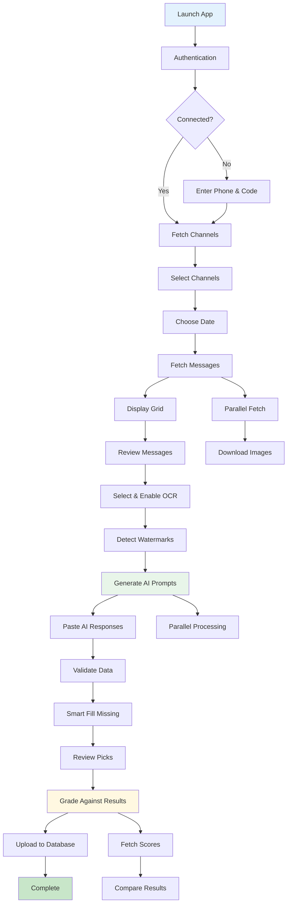

# Telegram Scraper

A streamlined sports betting picks management application that automates extraction, parsing, grading, and uploading of betting picks from Telegram channels. Built with Python, Flask, and modern web technologies.


## 🎯 What It Does

Telegram Scraper helps sports betting analysts automate their workflow by:

- **Extract** picks from Telegram channels and groups
- **Parse** unstructured data using AI and OCR
- **Grade** picks against real game results
- **Upload** processed data to cloud databases

## 🚀 Quick Start

### Installation

```bash
# Clone and setup
git clone <repository-url>
cd TelegramScraper
python -m venv venv
source venv/bin/activate  # Windows: venv\Scripts\activate
pip install -r requirements.txt
```

### Run the Application

```bash
python main.py
```

### 4-Step Workflow

1. **Connect** - Authenticate with Telegram using your phone number
2. **Select** - Choose channels and target date for picks
3. **Process** - Review messages, enable OCR, and generate AI prompts
4. **Grade** - Compare picks against results and upload to database

## 🔄 Complete Workflow


```mermaid
flowchart TD
    A[Launch App] --> B[Authentication]
    B --> C{Connected?}
    C -->|No| D[Enter Phone & Code]
    C -->|Yes| E[Fetch Channels]
    D --> E
    
    E --> F[Select Channels]
    F --> G[Choose Date]
    G --> H[Fetch Messages]
    H --> I[Display Grid]
    
    I --> J[Review Messages]
    J --> K[Select & Enable OCR]
    K --> L[Detect Watermarks]
    L --> M[Generate AI Prompts]
    
    M --> N[Paste AI Responses]
    N --> O[Validate Data]
    O --> P[Smart Fill Missing]
    P --> Q[Review Picks]
    
    Q --> R[Grade Against Results]
    R --> S[Upload to Database]
    S --> T[Complete]
    
    %% Parallel processing
    H --> AA[Parallel Fetch]
    AA --> BB[Download Images]
    M --> CC[Parallel Processing]
    R --> DD[Fetch Scores]
    DD --> EE[Compare Results]
    
    style A fill:#e3f2fd
    style T fill:#c8e6c9
    style M fill:#e8f5e9
    style R fill:#fff8e1
```

## 🛠️ Key Features

- **Telegram Integration**: Connect to multiple channels and fetch messages
- **OCR Processing**: Extract text from images using Tesseract
- **AI-Powered Parsing**: Convert unstructured data to structured JSON
- **Smart Filtering**: Remove watermarks and noise
- **Automatic Grading**: Compare picks against ESPN API results
- **Cross-Platform**: Works on Windows, macOS, and Linux
- **Desktop App**: Package as standalone executable

## 📦 Building the Desktop App

```bash
# Clean and build
rm -rf dist/ build/ *.spec
python build_app.py
# Executable created in /dist
```

The built application is completely self-contained with no external dependencies required.

## ⚙️ Configuration

Create a `.env` file with your credentials:

```env
# Telegram API
API_ID=your_telegram_api_id
API_HASH=your_telegram_api_hash

# Supabase (Optional)
SUPABASE_URL=your_supabase_url
SUPABASE_KEY=your_supabase_key
```

## 🤝 Contributing

1. Fork the repository
2. Create a feature branch: `git checkout -b feature-name`
3. Commit your changes: `git commit -m 'Add feature'`
4. Push to your fork: `git push origin feature-name`
5. Create a Pull Request

## 📄 License

MIT License - see [LICENSE](LICENSE) file for details.

---

**Telegram Scraper** - Streamlining sports betting data management 🎯