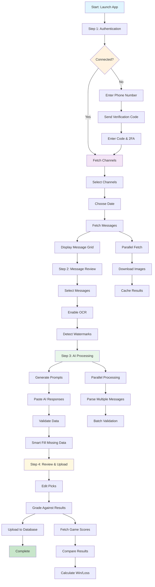
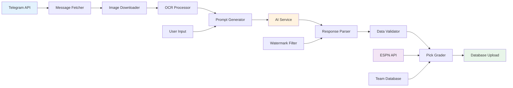

# CapperSuite

A comprehensive sports betting picks management application that automates the extraction, parsing, grading, and uploading of betting picks from Telegram channels. Built with Python, Flask, and a modern web interface.


## 🎯 Overview

CapperSuite is designed for sports betting analysts and data managers who need to:

- **Extract** betting picks from Telegram channels and groups
- **Parse** and structure unstructured betting data using AI
- **Grade** picks against actual game results automatically
- **Upload** processed data to cloud databases

The application provides a desktop-like experience through a web interface with four-step workflow management.

## 🚀 Features

### Core Functionality
- **Telegram Integration**: Connect to multiple channels and fetch messages with images and text
- **OCR Processing**: Extract text from images using Tesseract OCR with cross-platform support
- **AI-Powered Parsing**: Convert unstructured betting data into structured JSON format
- **Smart Filtering**: Remove watermarks, ads, and noise from extracted content
- **Automatic Grading**: Compare picks against real game results from ESPN API
- **Data Management**: Upload processed picks to Supabase or export for analysis

### Technical Highlights
- **Cross-Platform**: Works on Windows, macOS, and Linux
- **Desktop App**: Can be packaged as a standalone executable with PyInstaller
- **Real-time Processing**: Parallel fetching and processing of data
- **Smart Caching**: Caches game results to avoid repeated API calls
- **Team Recognition**: Extensive database of sports team aliases for accurate matching
- **Multi-Capper Support**: Handles messages containing picks from multiple analysts

## 📋 Table of Contents

- [Installation](#installation)
- [Quick Start](#quick-start)
- [Usage](#usage)
- [Application Workflow](#application-workflow)
- [Architecture](#architecture)
- [Configuration](#configuration)
- [Building the Desktop App](#building-the-desktop-app)
- [Contributing](#contributing)
- [License](#license)
- [Support](#support)

## 🛠️ Installation

### Prerequisites

- Python 3.8 or higher
- Git
- [Tesseract OCR](https://github.com/tesseract-ocr/tesseract) (optional for development)

### Clone and Setup

```bash
# Clone the repository
git clone <repository-url>
cd CapperSuite

# Create virtual environment
python -m venv venv
source venv/bin/activate  # On Windows: venv\Scripts\activate

# Install dependencies
pip install -r requirements.txt
```

### Tesseract Setup

#### Option 1: System Installation (Development)
```bash
# macOS
brew install tesseract tesseract-lang

# Ubuntu/Debian
sudo apt-get install tesseract-ocr tesseract-ocr-eng

# Windows
# Download from: https://github.com/UB-Mannheim/tesseract/wiki
```

#### Option 2: Use Bundled Binaries (Recommended for App)
The application includes pre-bundled Tesseract binaries in the `/bin` folder for Windows and macOS, making it completely portable.

## 🚀 Quick Start

1. **Run the Application**
   ```bash
   python main.py
   ```

2. **Connect to Telegram**
   - Enter your phone number in the authentication panel
   - Send the verification code
   - Complete 2FA if required

3. **Select Channels**
   - Choose Telegram channels/groups containing betting picks
   - Select the target date for picks

4. **Review and Process**
   - Select relevant messages
   - Configure OCR and filtering options
   - Generate AI prompts and paste responses

5. **Grade and Upload**
   - Review parsed picks
   - Grade against actual results
   - Upload to your database

## 📖 Usage

### Step-by-Step Workflow

#### Step 1: Source Selection
- **Authentication**: Securely connect to Telegram using your phone number
- **Channel Discovery**: Browse and select channels/groups to monitor
- **Date Filtering**: Choose specific dates to fetch messages from

#### Step 2: Message Review
- **Grid View**: Browse fetched messages with thumbnails
- **Selection**: Choose which messages to process
- **OCR Toggle**: Enable/disable image text extraction per message

#### Step 3: AI Processing
- **Watermark Detection**: Automatically detect and remove channel watermarks
- **Prompt Generation**: Create AI prompts for parsing betting data
- **Response Processing**: Paste AI responses and validate parsed data
- **Smart Filling**: Automatically fill missing capper names and leagues

#### Step 4: Review & Upload
- **Data Validation**: Review and edit parsed picks in a spreadsheet-like interface
- **Result Grading**: Automatically grade picks against real game results
- **Upload**: Send processed data to Supabase or export for analysis

### Command Line Usage

```bash
# Run development server
python main.py

# Build desktop application
python build_app.py

# Copy code for debugging/analysis
python copy_code.py
```

## 🔄 Application Workflow


```mermaid
graph TD
    A[Start: Launch App] --> B[Step 1: Authentication]
    B --> C{Connected?}
    C -->|No| D[Enter Phone Number]
    C -->|Yes| E[Fetch Channels]
    D --> F[Send Verification Code]
    F --> G[Enter Code & 2FA]
    G --> E
    
    E --> H[Select Channels]
    H --> I[Choose Date]
    I --> J[Fetch Messages]
    J --> K[Display Message Grid]
    
    K --> L[Step 2: Message Review]
    L --> M[Select Messages]
    M --> N[Enable OCR]
    N --> O[Detect Watermarks]
    
    O --> P[Step 3: AI Processing]
    P --> Q[Generate Prompts]
    Q --> R[Paste AI Responses]
    R --> S[Validate Data]
    S --> T[Smart Fill Missing Data]
    
    T --> U[Step 4: Review & Upload]
    U --> V[Edit Picks]
    V --> W[Grade Against Results]
    W --> X[Upload to Database]
    X --> Y[Complete]
    
    %% Parallel processing
    J --> AA[Parallel Fetch]
    AA --> BB[Download Images]
    BB --> CC[Cache Results]
    
    P --> DD[Parallel Processing]
    DD --> EE[Parse Multiple Messages]
    EE --> FF[Batch Validation]
    
    W --> GG[Fetch Game Scores]
    GG --> HH[Compare Results]
    HH --> II[Calculate Win/Loss]
    
    style A fill:#e1f5fe
    style Y fill:#c8e6c9
    style C fill:#fff3e0
    style E fill:#f3e5f5
    style P fill:#e8f5e9
    style U fill:#fff8e1
```

## 🏗️ Architecture

### Application Structure

```
CapperSuite/
├── main.py                 # Flask application entry point
├── config.py              # Configuration and paths
├── build_app.py           # PyInstaller build script
├── copy_code.py           # Debug code copying utility
├── requirements.txt       # Python dependencies
├── src/                   # Core application modules
│   ├── grader.py         # Pick grading logic
│   ├── ocr_handler.py    # OCR processing with Tesseract
│   ├── prompt_builder.py # AI prompt generation
│   ├── score_fetcher.py  # ESPN API integration
│   ├── supabase_client.py # Database operations
│   ├── team_aliases.py   # Sports team database
│   ├── telegram_client.py # Telegram API integration
│   ├── utils.py          # Utility functions
│   └── ...
├── templates/             # Web interface templates
│   └── index.html
├── static/               # Static assets
│   ├── temp_images/      # Temporary image storage
│   └── logo.ico/.icns    # App icons
├── bin/                  # Platform-specific binaries
│   ├── win/              # Windows Tesseract
│   └── mac/              # macOS Tesseract
└── tessdata/             # Tesseract language data
    └── eng.traineddata
```

### Key Components

#### 1. **Telegram Client** (`src/telegram_client.py`)
- Manages Telegram API connections
- Fetches messages with images and text
- Handles authentication and session management
- Implements rate limiting and anti-flood measures

#### 2. **OCR Handler** (`src/ocr_handler.py`)
- Processes images using Tesseract OCR
- Cross-platform binary management
- Automatic library path configuration
- Error handling and fallback mechanisms

#### 3. **Prompt Builder** (`src/prompt_builder.py`)
- Generates structured AI prompts
- Handles multiple capper detection
- Standardizes league and pick formats
- Creates revision prompts for data correction

#### 4. **Score Fetcher** (`src/score_fetcher.py`)
- Scrapes ESPN API for game results
- Supports multiple sports and leagues
- Parallel fetching for performance
- Comprehensive team alias matching

#### 5. **Grader** (`src/grader.py`)
- Compares picks against actual results
- Handles various bet types (ML, Spread, Total)
- Push detection for ties
- Extensive team recognition database

## ⚙️ Configuration

### Environment Variables

Create a `.env` file in the project root:

```env
# Telegram API
API_ID=your_telegram_api_id
API_HASH=your_telegram_api_hash

# Supabase (Optional)
SUPABASE_URL=your_supabase_url
SUPABASE_KEY=your_supabase_key

# ESPN API (Optional - for custom endpoints)
ESPN_API_BASE=https://site.api.espn.com/apis/site/v2/sports
```

### Configuration File (`config.py`)

The application automatically detects whether it's running as a script or compiled executable and adjusts paths accordingly:

- **Development**: Uses local paths for easier debugging
- **Production**: Uses bundled resources for portability
- **Platform Detection**: Automatically selects appropriate binaries

### Team Aliases (`src/team_aliases.py`)

Comprehensive database of sports team aliases including:
- Official team names
- Common abbreviations
- Historical names
- League-specific variations

## 📦 Building the Desktop App

### Prerequisites

- PyInstaller: `pip install pyinstaller`
- Platform-specific icons (`.ico` for Windows, `.icns` for macOS)

### Build Process

```bash
# Clean previous builds
rm -rf dist/ build/ *.spec

# Build for current platform
python build_app.py

# The executable will be in the /dist folder
```

### Build Features

- **Automatic Resource Bundling**: Includes all necessary files
- **Platform Detection**: Creates appropriate executables
- **Icon Integration**: Uses platform-specific icons
- **Dependency Management**: Bundles all Python packages
- **Binary Inclusion**: Includes Tesseract OCR binaries

### Distribution

The built application is completely self-contained:
- No Python installation required
- No additional dependencies
- Includes Tesseract OCR
- Works offline (except for API calls)

## 🤝 Contributing

We welcome contributions! Please follow these steps:

1. **Fork** the repository
2. **Clone** your fork: `git clone <your-fork-url>`
3. **Create** a feature branch: `git checkout -b feature-name`
4. **Commit** your changes: `git commit -m 'Add feature'`
5. **Push** to your fork: `git push origin feature-name`
6. **Create** a Pull Request

### Development Setup

```bash
# Clone your fork
git clone <your-fork-url>
cd CapperSuite

# Create virtual environment
python -m venv venv
source venv/bin/activate

# Install development dependencies
pip install -r requirements.txt
pip install pytest black flake8  # Development tools

# Run tests
pytest

# Code formatting
black src/ templates/ static/
```

### Code Style

- Follow PEP 8 guidelines
- Use meaningful variable names
- Add docstrings to functions and classes
- Keep lines under 88 characters

## 📄 License

This project is licensed under the MIT License - see the [LICENSE](LICENSE) file for details.

```
MIT License

Copyright (c) 2024 CapperSuite

Permission is hereby granted, free of charge, to any person obtaining a copy
of this software and associated documentation files (the "Software"), to deal
in the Software without restriction, including without limitation the rights
to use, copy, modify, merge, publish, distribute, sublicense, and/or sell
copies of the Software, and to permit persons to whom the Software is
furnished to do so, subject to the following conditions:

The above copyright notice and this permission notice shall be included in all
copies or substantial portions of the Software.

THE SOFTWARE IS PROVIDED "AS IS", WITHOUT WARRANTY OF ANY KIND, EXPRESS OR
IMPLIED, INCLUDING BUT NOT LIMITED TO THE WARRANTIES OF MERCHANTABILITY,
FITNESS FOR A PARTICULAR PURPOSE AND NONINFRINGEMENT. IN NO EVENT SHALL THE
AUTHORS OR COPYRIGHT HOLDERS BE LIABLE FOR ANY CLAIM, DAMAGES OR OTHER
LIABILITY, WHETHER IN AN ACTION OF CONTRACT, TORT OR OTHERWISE, ARISING FROM,
OUT OF OR IN CONNECTION WITH THE SOFTWARE OR THE USE OR OTHER DEALINGS IN THE
SOFTWARE.
```

## 熊️ Support

### Getting Help

- **Issues**: Report bugs and request features on [GitHub Issues](https://github.com/your-username/CapperSuite/issues)
- **Documentation**: Check this README and code comments
- **Debug Mode**: Use `python copy_code.py` to extract project code for analysis

### Troubleshooting

#### Common Issues

1. **Tesseract Not Found**
   - Ensure Tesseract is installed or use bundled binaries
   - Check `config.py` paths are correct

2. **Telegram Connection Failed**
   - Verify API credentials in `config.py`
   - Check internet connection
   - Ensure phone number format is correct (+1234567890)

3. **OCR Results Poor**
   - Check image quality
   - Verify Tesseract language data is installed
   - Try different image preprocessing

4. **Grading Inaccurate**
   - Check team aliases in `src/team_aliases.py`
   - Verify league mappings
   - Ensure game scores are being fetched correctly

#### Debug Tools

- **Debug Export**: `python copy_code.py` extracts all source code
- **Session Management**: User sessions are saved for convenience
- **Error Logging**: Check console output for detailed error messages
- **Network Monitoring**: Use browser dev tools to monitor API calls

### Performance Tips

- **Parallel Processing**: The app fetches and processes data in parallel
- **Caching**: Game results are cached to avoid repeated API calls
- **Memory Management**: Temporary images are cleaned up automatically
- **Batch Operations**: Process multiple messages together for better performance

## 🙏 Acknowledgments

- **Tesseract OCR**: For powerful optical character recognition
- **Telethon**: For excellent Telegram API integration
- **Flask**: For reliable web framework
- **ESPN**: For comprehensive sports data
- **Supabase**: For modern database solutions

## 📊 Data Flow Diagram


```mermaid
graph LR
    A[Telegram API] --> B[Message Fetcher]
    B --> C[Image Downloader]
    C --> D[OCR Processor]
    D --> E[Prompt Generator]
    E --> F[AI Service]
    F --> G[Response Parser]
    G --> H[Data Validator]
    H --> I[Pick Grader]
    I --> J[Database Upload]
    
    K[ESPN API] --> I
    L[User Input] --> E
    M[Team Database] --> I
    N[Watermark Filter] --> G
    
    style A fill:#e3f2fd
    style J fill:#e8f5e9
    style F fill:#fff3e0
    style K fill:#f3e5f5
```

---

**CapperSuite** - Streamlining sports betting data management, one pick at a time. 🎯