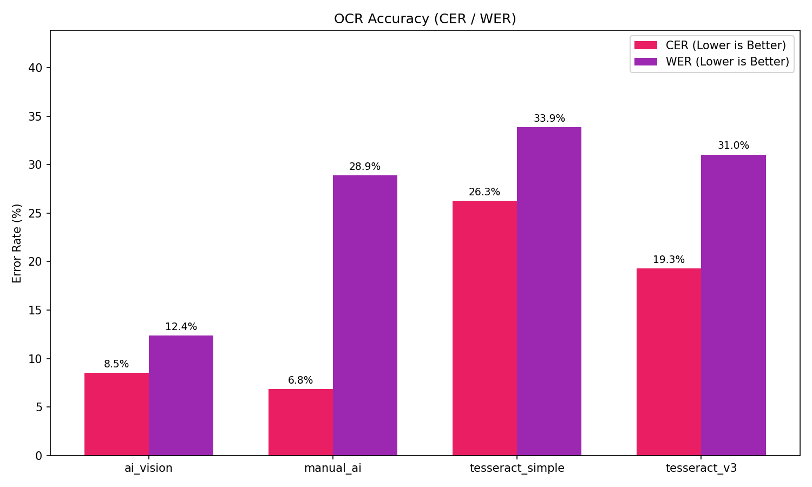
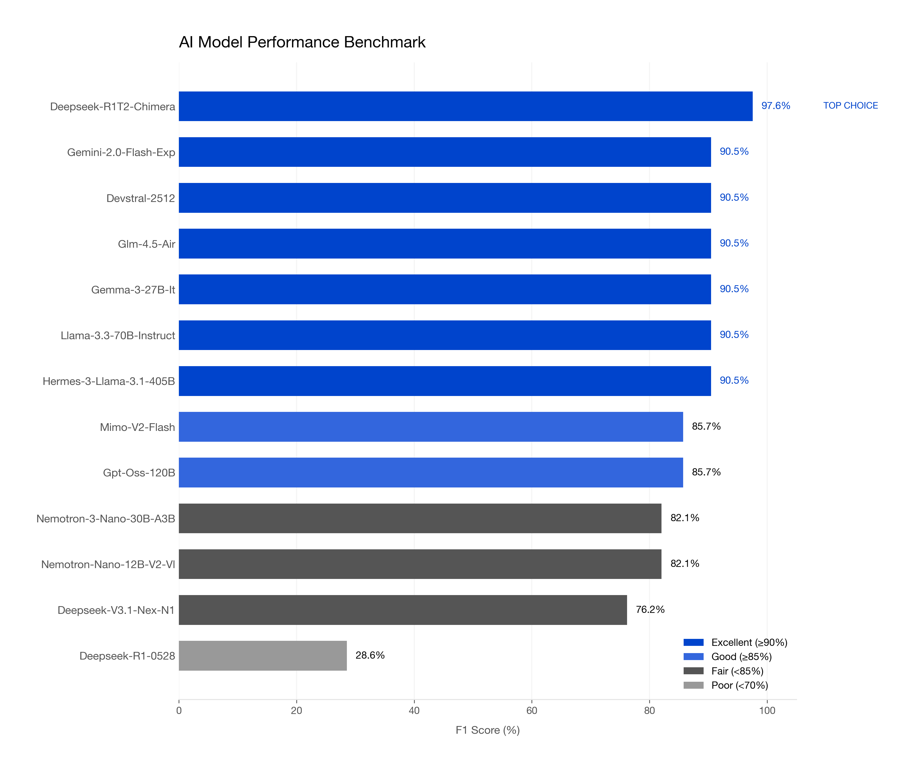

# Telegram Scraper 3.0 (CapperSuite)

  

**CapperSuite** is a professional-grade desktop intelligence tool for sports bettors. It aggregates, parses, and analyzes betting picks from Telegram channels using advanced **Vision AI** and **Large Language Models**.

> **New in v3.0:** A complete rewrite of the OCR extraction engine. We've replaced the legacy Tesseract system with state-of-the-art **Cloud Vision AI (Gemma 3 & Qwen 2.5)**, enabling 96%+ accuracy on handwritten notes and complex slips.

---

## 🚀 Key Features

*   **🤖 Vision AI Engine**: Replaced legacy Tesseract OCR with **Google's Gemma-3-12b** and **Qwen-2.5-VL**. Now capable of reading handwritten notes, complex tables, and low-res screenshots with **96%+ accuracy**.
*   **⚡ Smart Batching**: Processes up to **32 images per batch** (optimized to 8 for Vision AI), reducing API overhead by 80%.
*   **🧠 Intelligence Refinery**: An AI-powered review system that validates picks, standardizes team names, and deduces missing odds/units automatically.
*   **📊 Auto-Grading**: Automatically grades picks as **WIN**, **LOSS**, or **PUSH** by fetching live scores and comparing them against your extracted data.
*   **🔄 Multi-Channel Sync**: Connects directly to your Telegram account to scrape multiple channels simultaneously.
*   **🛠️ Standalone App**: No Python required for end-users. Runs as a native `.exe` or `.app` with a built-in web server and GUI.

---

## 📈 Performance Benchmarks

### Pick Extraction Accuracy (January 2026)

We benchmarked 4 OCR/parsing pipelines against a **Golden Set** of 30 real betting slip images (132 picks) validated by multimodal AI.

### Results (5 Image Subset)

#### 1. OCR Accuracy (CER/WER) - 4 Engines Benchmarked


| Engine | CER (Lower is better) | WER (Lower is better) |
| :--- | :---: | :---: |
| **Manual/Online AI** | **6.8%** 🏆 | **28.9%** |
| AI Vision | 8.5% | 12.4% 🏆 |
| Tesseract V3 | 19.3% | 31.0% |
| Tesseract Simple | 26.3% | 33.9% |

#### 2. Parsing Accuracy (F1 Score) - 13 Models Benchmarked


| Model | Precision | Recall | F1 Score | Latency |
| :--- | :---: | :---: | :---: | :---: |
| **DeepSeek R1T2 Chimera** | **100.0%** | **95.2%** | **97.6%** 🏆 | 27.7s |
| Gemini 2.0 Flash | 90.5% | 90.5% | 90.5% | 6.4s (fastest) |
| Mistral Devstral | 90.5% | 90.5% | 90.5% | 21.2s |
| GLM 4.5 Air | 90.5% | 90.5% | 90.5% | 58.4s |
| Gemma 3 27B | 90.5% | 90.5% | 90.5% | 20.8s |
| Llama 3.3 70B | 90.5% | 90.5% | 90.5% | 10.2s |
| Hermes 3 405B | 90.5% | 90.5% | 90.5% | 30.6s |
| Xiaomi MiMo v2 | 85.7% | 85.7% | 85.7% | 8.0s |
| GPT-OSS 120B | 85.7% | 85.7% | 85.7% | 13.0s |
| Nemotron 3 Nano 30B | 88.9% | 76.2% | 82.1% | 12.0s |
| Nemotron Nano 12B VL | 88.9% | 76.2% | 82.1% | 35.9s |
| DeepSeek V3.1 Nex | 76.2% | 76.2% | 76.2% | 32.2s |
| DeepSeek R1 0528 | 57.1% | 19.0% | 28.6% | 54.1s |

### Key Findings

1.  **DeepSeek R1T2 Chimera Excellence**: Achieved 97.6% F1 with **100% precision** (zero false positives), making it the clear winner for parsing accuracy.
2.  **Gemini 2.0 Flash Best Value**: Tied for 2nd place (90.5% F1) with the **fastest latency** (6.4s), making it the best balance of speed and accuracy.
3.  **Large Models Underperform**: DeepSeek R1 0528 (28.6% F1) performed poorly despite its size, likely due to overly verbose reasoning.


### Pipelines Tested
*   **AI Vision**: Sending raw images directly to Vision AI (e.g., Gemini 2.0).
*   **Manual Refinery**: Manually uploading images to a superior AI (e.g., GPT-4o Web) to bypass API limits and getting "perfect" results.
*   **Tesseract v3**: Specialized local OCR with upscaling and thresholding.
*   **Tesseract Simple**: Basic local OCR (Baseline).

### Running the Benchmark

The benchmark system has been overhauled (Jan 2026) to verify individual components.

#### 1. Generate Golden Set (One-time Setup)
See [benchmark/dataset/GENERATION_INSTRUCTIONS.md](benchmark/dataset/GENERATION_INSTRUCTIONS.md).

#### 2. Run Benchmarks

**Benchmark 1: OCR Accuracy**
Measures CER/WER of Tesseract vs AI Vision.
```bash
python benchmark/runners/run_ocr_only.py --engine tesseract_v3
python benchmark/runners/run_ocr_only.py --engine ai_vision
```

**Benchmark 2: Manual Refinery (Human-AI)**
Benchmark an online AI manually against the dataset.
1. See [benchmark/dataset/MANUAL_BENCHMARK_GUIDE.md](benchmark/dataset/MANUAL_BENCHMARK_GUIDE.md).
2. Save results to `benchmark/reports/manual_ocr_input.json`.
3. Score results:
```bash
python benchmark/runners/score_manual_ocr.py
```

**Benchmark 3: AI Parsing Accuracy**
Measures F1 Score, Precision, and Recall for 13 LLMs.
```bash
# Run all models (takes ~30-60 mins)
python benchmark/runners/run_parsing_only.py
```


---

## 🛠️ Installation

### For End Users
Download the latest release for your OS from the [Releases Page](#):
*   **Windows**: `TelegramScraper-v3.0.0.exe`
*   **macOS**: `TelegramScraper-v3.0.0.app`

On first launch, you will be asked to log in with your Telegram phone number. The session is stored locally on your machine.

### For Developers

1.  **Clone the repository**:
    ```bash
    git clone https://github.com/Ducky705/Telegram-Scraper.git
    cd Telegram-Scraper
    ```

2.  **Install dependencies**:
    ```bash
    pip install -r requirements.txt
    ```

3.  **Configure Environment**:
    Create a `.env` file in the root directory:
    ```env
    API_ID=your_api_id
    API_HASH=your_api_hash
    OPENROUTER_API_KEY=your_key
    SUPabase_URL=your_url         # Optional
    SUPabase_KEY=your_key         # Optional
    ```

4.  **Run from source**:
    ```bash
    python main.py
    ```

---

## 📖 Usage Workflow

1.  **Select Channels**: Choose the Telegram channels you want to scrape from the sidebar.
2.  **Fetch Messages**: Click **"Initialize Data Fetch"**. The app will download the latest messages and images.
3.  **AI Extraction**: The system automatically runs OCR (Vision AI) and parses the text into structured picks.
4.  **Refine**: Use the **"Intelligence Refinery"** to manually review picks, merge duplicates, and fix any low-confidence entries.
5.  **Export**: Export your verified table to CSV or sync to the Supabase database.

---

## 🏗️ Architecture

*   **Frontend**: HTML5 / TailwindCSS / Vanilla JS (Served via Flask)
*   **Backend**: Python 3.10+ (Flask + Waitress)
*   **GUI**: `pywebview` (Chromium wrapper)
*   **AI Layer**: OpenRouter API (Accessing Google Gemma 3, Qwen 2.5, Mistral)
*   **OCR**: Hybrid (Tesseract Local Fallback + Vision LLM)

---

## 📄 License
Private / Proprietary