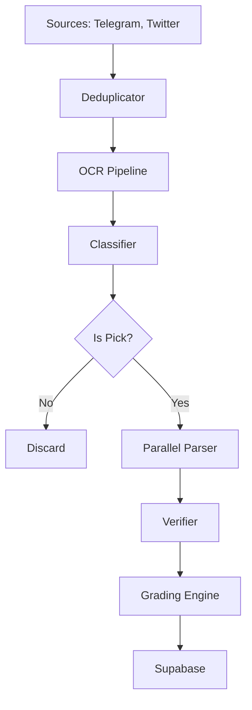

# System Architecture

CapperSuite is a pipeline-based application designed for high throughput and reliability. It processes unstructured data (Telegram messages, Tweets, Images) into structured, graded betting records.

## Data Flow

## Module Overview

| Directory/File | Purpose | Key Components |
|----------------|---------|----------------|
| `src/` | Core logic | Scrapers, Clients, Utilities |
| `src/grading/` | Grading System | Engine, Matcher, Parser (V3) |
| `src/prompts/` | Prompt Management | Schema, Decoder, Builder |
| `src/ocr_*.py` | OCR Subsystem | RapidOCR, Vision Cascade |
| `src/*_client.py` | API Clients | Groq, Mistral, Telegram, Supabase |
| `benchmark/` | Testing Tools | Accuracy/Speed Benchmarks |
| `tools/` | Utility Scripts | Golden Set management, Quick tests |

## Design Principles

1.  **Fail-Fast & Fallback**: Systems like OCR and Parsing have primary (fast/cheap) methods and secondary (slow/powerful) fallbacks.
2.  **Parallelism**: Network-bound operations (API calls) are parallelized using `ThreadPoolExecutor`.
3.  **Token Efficiency**: Prompts are optimized to minimize cost and latency.
4.  **Modularity**: Components (Grading, OCR) are isolated to allow independent upgrades.

## Key Workflows

### 1. The Scraping Loop (`cli_tool.py`)
- Fetches messages for a target date.
- Runs the pipeline steps sequentially: Dedupe -> OCR -> Classify -> Parse -> Grade -> Upload.

### 2. The Parsing Flow
- **Input**: Raw text + OCR text.
- **Process**: 
  - Messages are batched (e.g., 10 at a time).
  - `ParallelBatchProcessor` assigns batches to available providers.
  - LLMs return compact JSON.
  - Decoder expands JSON to full objects.
- **Output**: List of `Pick` dictionaries.

### 3. The Grading Flow
- **Input**: `Pick` objects.
- **Process**:
  - `Loader` fetches ESPN scores for the date.
  - `Matcher` links picks to games.
  - `Engine` applies betting rules.
- **Output**: Graded picks with results.
