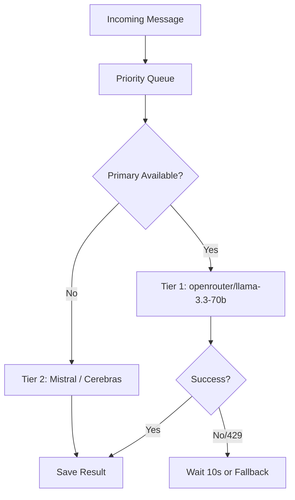

# AI Providers & Smart Cascading Strategy (Accuracy Optimized)
*Updated: 2026-02-17*

CapperSuite utilizes a **"Complexity Router"** strategy (Smart Cascading) to balance **Accuracy, Efficiency, and Speed**. 
Unlike previous iterations which prioritized speed (Groq), the current architecture prioritizes **ACCURACY** and **RELIABILITY** (Uptime) for free-tier models.

## The Hierarchy (Scientifically Optimized - Feb 2026)

### Tier 1: The "Accuracy King" (High Intelligence, Free)
*   **Primary:** **OpenRouter (meta-llama/llama-3.3-70b-instruct:free)**
    *   **Status:** **CHAMPION**. 100% Accuracy on Golden Set. Handles complex reasoning.
    *   **Rate Limit:** Configured to **10 RPM** to minimize 429 errors.
    *   **Retry Logic:** Active. Sleeps 10s on Rate Limit.
    *   **Role:** Processing 95% of messages.

### Tier 2: The "Speed Backups" (High Speed, Lower Intelligence)
*   **Primary Fallback:** **Mistral (open-mistral-nemo)**
    *   **Status:** **ACTIVE**. Very fast (~0.7s). Used when OpenRouter is busy/down.
*   **Secondary Fallback:** **Cerebras (llama-3.1-8b)**
    *   **Status:** **ACTIVE**. Sub-second latency. Good for simple messages.
    *   **Role:** Emergency backups. Note: 8B models may hallucinate on complex parsing.

### Tier 3: The "Unstable" (Disabled)
*   **Groq (Llama-70b/8b)**. Status: **DISABLED** (403 Forbidden).
*   **Gemini Direct (Flash 2.0)**. Status: **DISABLED** (429 Rate Limit immediately).

## Logic Flow

## Configuration Constants

| Setting | Value | Reason |
|---------|-------|--------|
| **OpenRouter RPM** | `10` | Conservative limit to prevent frequent 429s on free tier. |
| **Mistral RPM** | `60` | Higher limit, but lower intelligence. |
| **Timeout** | `25s` | Allows for Llama 3.3 inference time (~2-5s) + retry buffer. |

## Supported Providers & Config

| Provider | Tier | Role | Models | Status |
|----------|------|------|--------|--------|
| **OpenRouter** | 1 | **Primary Accuracy** | `llama-3.3-70b-instruct:free` | **ACTIVE** |
| **Mistral** | 2 | Speed Backup | `open-mistral-nemo` | **ACTIVE** |
| **Cerebras** | 2 | Speed Backup | `llama-3.1-8b` | **ACTIVE** |
| **Groq** | 3 | Legacy Speed | `llama-3.3-70b` | **DISABLED (403)** |
| **Gemini** | 3 | Legacy Speed | `gemini-2.0-flash` | **DISABLED (429)** |
